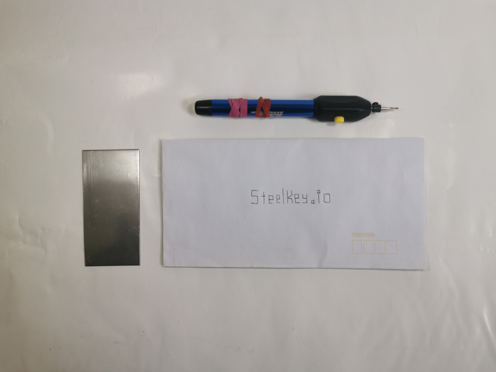

# Simple Steel Crypto Key

## Misson 

The simplest, most durable storage media for your `crypto keys`.

## Vision

Give consumers a choice when it comes to their keys, keeping the cost low, errors lower and just not making a huge fuss out of the whole thing.

## Out of Scope

We will not compete with the existing products on the market. They are highly refined products with other benefits and tradeoffs, and most are probably easier and nicer to use. In fact, if we believe our users would benefit from them, we should redirect them (and get a commission). 
If a user believes that the price is too high, we are providing a cypherpunk alternative to all the expensive ones, with centuries old battle tested technology. Just engraving on steel. Almost indestructible.

> This is a starter template for [Learn Next.js](https://nextjs.org/learn).

> This repository should be kept private, and then deployed to https://steelkey.dilger.dev